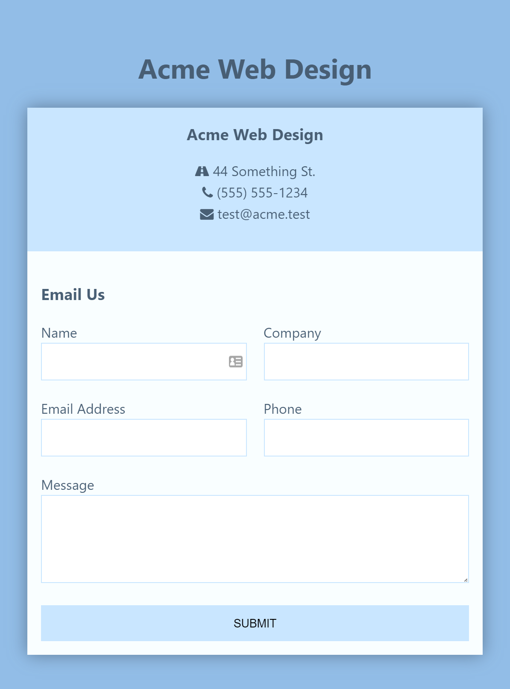

# Responsive Mobile First Contact Form

### About

In this project we build a responsive, mobile first contact form using HTML and CSS, utilizing CSS3 styling along with the Grid layout. We'll also use icons from Font Awesome and a simple entry animation using animate.css.

### Acknowledgement

Thanks to Traversy Media on YouTube for another fantastic tutorial!
